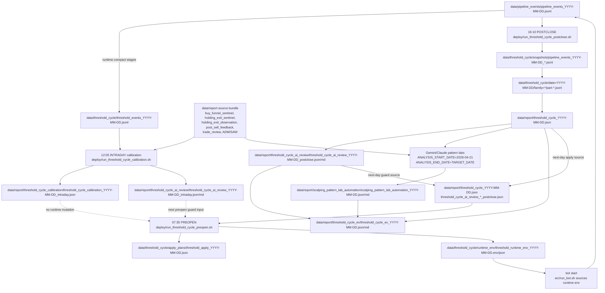

# KORStockScan

KORStockScan은 키움 REST/WebSocket, 실시간 스캐너, AI 판단, 주문/체결 상태머신, 장후 복기 리포트를 하나의 운영 루프로 묶은 한국 주식 자동매매/튜닝 플랫폼입니다.

업데이트 기준: `2026-05-08 KST`
현재 운영 단계: `Plan Rebase`

## 현재 목표

이 프로젝트의 현재 목표는 손실 억제가 아니라 `기대값/순이익 극대화`입니다. 운영 판단은 `main-only`, `normal_only`, `post_fallback_deprecation` 기준으로 보며, 손익 계산은 `COMPLETED + valid profit_rate`만 사용합니다. `NULL`, 미완료 상태, fallback 정규화 값은 손익 기준에서 제외합니다.

핵심 판정 순서는 `거래수 -> 퍼널 -> blocker -> 체결품질 -> missed_upside -> 손익`입니다. BUY 후 미진입은 `latency guard miss`, `liquidity gate miss`, `AI threshold miss`, `overbought gate miss`로 분리하고, `full fill`과 `partial fill`은 합산하지 않습니다.

현재 기준 문서는 [Plan Rebase](docs/plan-korStockScanPerformanceOptimization.rebase.md)이며, 실제 실행 항목은 날짜별 `docs/YYYY-MM-DD-stage2-todo-checklist.md`가 소유합니다.

## 시스템 개요

운영 흐름은 아래 파이프라인으로 구성됩니다.

1. 스캐너와 조건검색식이 후보 종목을 생성합니다.
2. 실시간 시세, 호가, 체결강도, 수급, AI 판단을 묶어 WATCHING 후보를 평가합니다.
3. 진입 latency/가격/유동성/AI gate를 통과한 종목만 주문 후보로 넘깁니다.
4. 주문/체결 receipt와 position tag를 기준으로 `BUY_ORDERED`, `HOLDING`, `SELL_ORDERED`, `COMPLETED` 상태를 관리합니다.
5. 보유 중에는 soft stop, trailing, AI holding review, scale-in/pyramid, bad-entry, overnight gate를 분리 판단합니다.
6. 장중/장후 pipeline event, monitor snapshot, threshold report, post-sell feedback으로 복기와 다음 튜닝 owner를 고정합니다.

## 주요 기능

- 키움 REST/WebSocket 기반 실시간 시세, 주문, 체결, 잔고 처리.
- 스캘핑 중심 WATCHING/HOLDING 상태머신과 주문 receipt 정합성 관리.
- Gemini, DeepSeek, OpenAI 라우팅을 포함한 AI 판단 엔진과 endpoint schema contract.
- 실시간 pipeline event JSONL 로깅과 compact threshold event stream.
- entry pipeline, trade review, performance tuning, post-sell feedback, missed-entry counterfactual, holding/exit observation 리포트.
- threshold cycle 장중/장후 calibration, AI correction, 장전 `auto_bounded_live` runtime env apply, daily EV report 자동화.
- Gemini/Claude scalping pattern lab 기반 improvement order와 auto family candidate 자동 생성.
- GitHub Project와 Google Calendar를 문서 checklist에서 동기화하는 운영 자동화.
- 웹 대시보드와 JSON API를 통한 일일 리포트, 진입 퍼널, gatekeeper replay, 성과 튜닝 조회.
- offline bundle 분석 도구로 장중 서버 로그 접근이 제한될 때도 same-slot 판정 가능.

## 현재 튜닝 진행축

현재 live/observe/open 축은 Plan Rebase 기준으로 관리합니다.

| 영역 | 현재 상태 |
| --- | --- |
| Entry operating override | `mechanical_momentum_latency_relief` ON. BUY 후 제출 drought를 줄이기 위한 운영 override이며 신규 OPEN 작업이 아니라 runtime load/health 확인 대상입니다. |
| Entry price | `dynamic_entry_price_resolver_p1` baseline + `dynamic_entry_ai_price_canary_p2` active canary. `target_buy_price`는 참고 기준가로만 쓰고, P2는 submitted 직전 AI가 `USE_DEFENSIVE`, `USE_REFERENCE`, `IMPROVE_LIMIT`, `SKIP` 중 하나를 선택합니다. |
| Orderbook micro | OFI/QI는 P2 내부 입력 feature입니다. standalone hard gate나 watching/holding/exit 확장은 별도 workorder 없이 금지합니다. bucket runtime calibration은 현재 OFF입니다. |
| Holding/exit | `soft_stop_micro_grace`, `REVERSAL_ADD`, `bad_entry_refined_canary`, `holding_flow_override`를 분리합니다. 조급한 청산으로 인한 missed upside와 bad-entry tail 절단의 순EV를 같이 봅니다. |
| Position sizing | 신규 BUY는 `1주 cap`을 유지합니다. `MAX_*_COUNT`는 runtime blocker가 아니라 attribution counter로 보고, 반복 주문 리스크는 cooldown, pending order, position cap, protection 재설정, near-close gate로 제한합니다. |
| AI engine | Gemini/DeepSeek/OpenAI 개선은 live routing 승격이 아니라 flag-off acceptance, endpoint schema contract, transport provenance로 관리합니다. OpenAI Responses WS는 shadow/observe-only입니다. |
| Threshold/action weight | threshold cycle 기본 apply mode는 완전 무인 `auto_bounded_live`입니다. deterministic guard + AI correction guard + same-stage owner rule을 통과한 family만 다음 장전 runtime env로 자동 반영합니다. 장중 runtime threshold mutation은 금지합니다. `statistical_action_weight`와 `holding_exit_decision_matrix`는 자체로 runtime을 바꾸지 않고 advisory/calibration 입력으로만 연결됩니다. |
| Runtime/report 품질 | NaN cast guard, execution receipt binding, threshold collector IO, counterfactual 3-mode, `exit_decision_source` provenance를 EV 판정 전제 품질축으로 봅니다. |

종료/폐기 축은 [closed observation archive](docs/archive/closed-observation-axes-2026-05-01.md)에서만 확인합니다. `fallback_scout/main`, `fallback_single`, `latency fallback split-entry`, 종료된 latency composite 축은 새 workorder와 rollback guard 없이 재개하지 않습니다.

## 코드 구조

```text
KORStockScan/
├── src/
│   ├── bot_main.py                         # 운영 루프, 스케줄, 봇 진입점
│   ├── run_bot.sh                          # 봇 실행 wrapper
│   ├── engine/                             # 매매 엔진, AI, 리포트, 자동화 CLI
│   ├── trading/                            # entry/orderbook 관련 세부 로직
│   ├── scanners/                           # 스캐너, 장전/장후 후보 분석
│   ├── web/                                # Flask 대시보드/API
│   ├── database/                           # DB manager와 모델
│   ├── model/                              # ML dataset/training/recommendation
│   ├── market_regime/                      # 시장 레짐 데이터/룰/서비스
│   ├── notify/                             # Telegram 등 알림
│   ├── utils/                              # constants, runtime flags, event logger
│   └── tests/                              # pytest 회귀 테스트
├── analysis/                               # offline bundle, pattern lab, 관찰 분석
├── data/
│   ├── config/                             # feature/threshold manifest
│   ├── gatekeeper/                         # gatekeeper snapshot JSONL
│   ├── pipeline_events/                    # runtime pipeline event JSONL
│   ├── post_sell/                          # post-sell candidate/evaluation JSONL
│   ├── report/                             # daily/monitor/threshold 리포트
│   ├── threshold_cycle/                    # threshold compact stream/apply plan
│   └── runtime/                            # runtime flag/state artifacts
├── deploy/                                 # cron, systemd, nginx, 운영 wrapper
├── docs/                                   # Plan Rebase, checklist, workorder, audit
├── logs/                                   # 운영 로그
└── README.md
```

## 핵심 모듈

| 모듈 | 역할 |
| --- | --- |
| `src/bot_main.py` | 메인 운영 루프, 08:45 daily report, 08:50 추천 브로드캐스트, 23:50 재시작 감지 등 |
| `src/engine/kiwoom_sniper_v2.py` | 스캘핑 엔진 본체와 Kiwoom runtime orchestration |
| `src/engine/sniper_state_handlers.py` | WATCHING/HOLDING/SELL 상태 처리, 청산/보유/flow override 판단 |
| `src/engine/sniper_entry_latency.py` | latency gate, mechanical momentum relief, entry price guard |
| `src/engine/sniper_scale_in.py` | REVERSAL_ADD, PYRAMID, scale-in blocker와 attribution |
| `src/engine/sniper_execution_receipts.py` | 주문/체결 receipt binding, 평균가/상태전이 정합성 |
| `src/engine/ai_engine.py` | 기본 AI endpoint와 Gemini 계열 판단 |
| `src/engine/ai_engine_openai.py` | OpenAI schema/transport parity와 Responses WS shadow 경로 |
| `src/engine/runtime_ai_router.py` | prompt별 provider/model tier routing |
| `src/utils/pipeline_event_logger.py` | runtime event JSONL과 threshold compact event 적재 |
| `src/engine/daily_threshold_cycle_report.py` | threshold report, statistical action weight, holding/exit decision matrix 생성 |
| `src/engine/threshold_cycle_preopen_apply.py` | 장전 threshold apply plan과 bounded runtime env 생성, 현재 기본 `auto_bounded_live` |
| `src/engine/scalping_pattern_lab_automation.py` | Gemini/Claude pattern lab 결과를 기존 family 입력, auto family 후보, code improvement order로 정규화 |
| `src/engine/threshold_cycle_ev_report.py` | 무인 apply 이후 daily EV 성과와 pattern lab automation 요약 제출 |
| `src/web/app.py` | Flask dashboard와 JSON API |

## 실행 방법

Python 작업은 프로젝트 `.venv`를 기본으로 사용합니다.

```bash
python3 -m venv .venv
source .venv/bin/activate
pip install -r requirements.txt
```

실거래 설정은 아래 파일과 환경변수에 의존합니다. 민감정보는 운영 환경에서만 관리합니다.

- `data/config_prod.json`
- `data/config_sample.json`
- `data/credentials.json`
- `src/utils/constants.py`
- `src/engine/sniper_config.py`

봇 실행:

```bash
PYTHONPATH=. .venv/bin/python src/bot_main.py
```

운영 wrapper:

```bash
cd src
bash run_bot.sh
```

웹/API 실행:

```bash
PYTHONPATH=. .venv/bin/python src/web/app.py
```

기본 바인딩은 `0.0.0.0:5000`입니다. systemd/nginx 운영 설정은 `deploy/systemd/`, `deploy/nginx/`를 봅니다.

## 주요 API

| 경로 | 용도 |
| --- | --- |
| `GET /api/daily-report?date=YYYY-MM-DD` | 일일 리포트 JSON |
| `GET /api/entry-pipeline-flow?date=YYYY-MM-DD&since=HH:MM:SS&top=10` | 진입 퍼널/blocked flow |
| `GET /api/gatekeeper-replay?date=YYYY-MM-DD&code=000000&time=HH:MM:SS` | gatekeeper 판단 복원 |
| `GET /api/performance-tuning?date=YYYY-MM-DD&since=HH:MM:SS` | 튜닝/성과 snapshot |
| `GET /api/post-sell-feedback?date=YYYY-MM-DD` | 매도 후 missed upside/good exit 평가 |
| `GET /api/strategy-performance?date=YYYY-MM-DD` | 전략/포지션 성과 |
| `GET /api/trade-review?date=YYYY-MM-DD&code=000000` | 거래 리뷰 |
| `GET /api/strength-momentum?date=YYYY-MM-DD&since=HH:MM:SS&top=10` | strength/momentum 분석 |

HTML 대시보드 경로는 `/`, `/dashboard`, `/daily-report`, `/entry-pipeline-flow`, `/gatekeeper-replay`, `/performance-tuning`, `/post-sell-feedback`, `/strategy-performance`, `/trade-review`, `/strength-momentum`입니다.

## 산출물과 로그

| 경로 | 내용 |
| --- | --- |
| `data/report/report_YYYY-MM-DD.json` | daily report canonical JSON |
| `data/report/monitor_snapshots/*_YYYY-MM-DD.json` | trade review, performance tuning, missed entry, post-sell 등 monitor snapshot |
| `data/report/threshold_cycle_YYYY-MM-DD.json` | 장후 threshold cycle canonical report |
| `data/report/threshold_cycle_calibration/threshold_cycle_calibration_YYYY-MM-DD_{intraday,postclose}.json` | 장중/장후 calibration artifact |
| `data/report/threshold_cycle_ai_review/threshold_cycle_ai_review_YYYY-MM-DD_{intraday,postclose}.{json,md}` | AI correction proposal와 deterministic guard 결과 |
| `data/report/scalping_pattern_lab_automation/scalping_pattern_lab_automation_YYYY-MM-DD.{json,md}` | pattern lab 기반 improvement order 및 auto family 후보 |
| `data/report/threshold_cycle_ev/threshold_cycle_ev_YYYY-MM-DD.{json,md}` | 무인 threshold 반영 이후 daily EV 성과 리포트 |
| `data/report/statistical_action_weight/` | statistical action weight JSON/Markdown |
| `data/report/holding_exit_decision_matrix/` | holding/exit decision matrix JSON/Markdown |
| `data/pipeline_events/pipeline_events_YYYY-MM-DD.jsonl` | runtime pipeline event stream |
| `data/threshold_cycle/threshold_events_YYYY-MM-DD.jsonl` | threshold compact event stream |
| `data/gatekeeper/gatekeeper_snapshots_YYYY-MM-DD.jsonl` | gatekeeper snapshot stream |
| `data/post_sell/post_sell_candidates_YYYY-MM-DD.jsonl` | post-sell 후보 |
| `data/post_sell/post_sell_evaluations_YYYY-MM-DD.jsonl` | post-sell 평가 |
| `logs/*.log` | runtime/cron/operator 로그 |
| `data/log_archive/YYYY-MM-DD/*.gz` | 압축된 날짜별 로그 archive |

JSON/JSONL이 canonical data이며, 사람이 장후 판정에 바로 읽어야 하는 항목만 Markdown report로 별도 생성합니다. report inventory는 [data/report/README.md](data/report/README.md)를 봅니다.

## 운영 자동화

| 자동화 | 경로 | 설명 |
| --- | --- | --- |
| threshold PREOPEN | `deploy/run_threshold_cycle_preopen.sh` | 전일 report/AI correction guard 기반 `auto_bounded_live` apply plan과 runtime env 생성 |
| threshold INTRADAY calibration | `deploy/run_threshold_cycle_calibration.sh` | 12:05 KST 장중 calibration/AI correction artifact 생성. runtime mutation 없음 |
| threshold POSTCLOSE | `deploy/run_threshold_cycle_postclose.sh` | compact backfill, postclose calibration/AI correction, pattern lab automation, daily EV report 생성 |
| tuning monitoring POSTCLOSE | `deploy/run_tuning_monitoring_postclose.sh` | Parquet/DuckDB refresh와 shadow diff. pattern lab은 기본 skip하고 `THRESHOLD_CYCLE_POSTCLOSE`를 canonical runner로 둠 |
| monitor snapshot | `deploy/run_monitor_snapshot_safe.sh`, `deploy/run_monitor_snapshot_incremental_cron.sh` | 장중/장후 snapshot 생성 |
| system metric sampler | `deploy/run_system_metric_sampler_cron.sh` | 1분 단위 시스템 지표 |
| daily workorder | `.github/workflows/build_codex_daily_workorder.yml` | checklist 기반 작업지시서 생성 |
| Project sync | `.github/workflows/sync_docs_backlog_to_project.yml` | 문서 backlog를 GitHub Project로 동기화 |
| Calendar sync | `.github/workflows/sync_project_to_google_calendar.yml` | GitHub Project 일정을 Google Calendar로 동기화 |

문서 checklist를 수정한 뒤 parser 검증:

```bash
PYTHONPATH=. .venv/bin/python -m src.engine.sync_docs_backlog_to_project --print-backlog-only --limit 500
```

Project/Calendar 동기화 표준 명령:

```bash
PYTHONPATH=. .venv/bin/python -m src.engine.sync_docs_backlog_to_project && PYTHONPATH=. .venv/bin/python -m src.engine.sync_github_project_calendar
```

## 자동화 체인 플로우차트

현재 daily threshold/scalping improvement 체인은 사람의 장전 승인 없이 돌아간다. 사람의 개입은 Project/Calendar 동기화, 신규 code improvement order를 실제 코드 패치로 전환하는 별도 작업, 운영 장애 대응에만 남긴다.



### 체인 검토 결과

| 검토 항목 | 판정 | 근거/처리 |
| --- | --- | --- |
| PREOPEN 적용과 INTRADAY calibration 충돌 | 충돌 없음 | 12:05 calibration은 `threshold_cycle_calibration_*_intraday`와 AI review만 만들고 runtime env를 바꾸지 않는다. 다음 장전 apply 후보 입력으로만 전달한다. |
| POSTCLOSE pattern lab과 tuning monitoring pattern lab 중복 | 충돌 제거 | canonical lab 실행 위치를 `THRESHOLD_CYCLE_POSTCLOSE`로 고정했다. `run_tuning_monitoring_postclose.sh`는 기본적으로 pattern lab을 skip하고 status에 `canonical_runner=THRESHOLD_CYCLE_POSTCLOSE`를 남긴다. |
| Pattern lab 결과의 runtime 직접 반영 | 차단 | `scalping_pattern_lab_automation`은 `code_improvement_order(runtime_effect=false)`와 `auto_family_candidate(allowed_runtime_apply=false)`만 생성한다. 실제 runtime 반영은 별도 구현/테스트 후 기존 `auto_bounded_live` guard를 통과해야 한다. |
| AI correction의 직접 적용 | 차단 | AI는 수정안을 제안하지만 최종 state/value는 deterministic guard가 bounds, sample window, safety, same-stage owner rule로 결정한다. |
| 사람 개입 누락 | daily chain에는 없음 | 무인 반영 후 제출물은 `threshold_cycle_ev_YYYY-MM-DD.{json,md}`다. 사람이 필요한 지점은 운영 장애, 신규 code improvement order 구현 착수, Project/Calendar 동기화뿐이며 daily threshold 반영 승인 단계는 의도적으로 제거했다. |
| `preclose_sell_target` tuning source 혼입 | 차단 | operator preclose review 산출물로만 둔다. calibration source bundle에는 포함하지 않는다. |

## 분석 도구

- `analysis/offline_live_canary_bundle/`: 장중 fresh 로그 접근이 어려울 때 lightweight bundle을 export하고 로컬 analyzer로 same-slot 판정을 닫는 standby diagnostic/report-only 도구. legacy gatekeeper/entry latency summary compatibility도 이 경로에서 생성한다.
- `analysis/offline_gatekeeper_fast_reuse_bundle/`: retired/deprecated compatibility wrapper와 과거 증적 링크 보존용. 신규 export/analyzer 표준 경로가 아니다.
- `analysis/gemini_scalping_pattern_lab/`, `analysis/claude_scalping_pattern_lab/`: `THRESHOLD_CYCLE_POSTCLOSE`에서 매일 `ANALYSIS_START_DATE=2026-04-21`, `ANALYSIS_END_DATE=TARGET_DATE`로 실행되는 스캘핑 패턴/EV 분석 lab. 결과는 `scalping_pattern_lab_automation`을 거쳐 기존 threshold family 입력, auto family 후보, code improvement order로만 쓰며 runtime/code를 직접 변경하지 않는다.
- `src/engine/server_report_comparison.py`: 원격 서버 report 비교. Plan Rebase 의사결정에서는 remote 비교값을 기본 입력에서 제외합니다.
- `src/engine/build_tuning_monitoring_parquet.py`, `src/engine/tuning_duckdb_repository.py`: 튜닝 관찰 데이터를 Parquet/DuckDB로 다루는 경로.

## 테스트

대표 테스트:

```bash
PYTHONPATH=. .venv/bin/pytest -q src/tests/test_sniper_entry_latency.py
PYTHONPATH=. .venv/bin/pytest -q src/tests/test_sniper_scale_in.py
PYTHONPATH=. .venv/bin/pytest -q src/tests/test_holding_flow_override.py
PYTHONPATH=. .venv/bin/pytest -q src/tests/test_daily_threshold_cycle_report.py
PYTHONPATH=. .venv/bin/pytest -q src/tests/test_ai_engine_openai_transport.py
PYTHONPATH=. .venv/bin/pytest -q src/tests/test_pipeline_event_logger.py
```

문서만 수정한 경우에도 checklist/parser 영향이 있으면 아래 검증을 우선 실행합니다.

```bash
PYTHONPATH=. .venv/bin/python -m src.engine.sync_docs_backlog_to_project --print-backlog-only --limit 500
```

## 주요 문서

| 문서 | 역할 |
| --- | --- |
| [docs/plan-korStockScanPerformanceOptimization.rebase.md](docs/plan-korStockScanPerformanceOptimization.rebase.md) | 현재 튜닝 원칙, active owner, live/observe/off 판정 |
| [docs/plan-korStockScanPerformanceOptimization.prompt.md](docs/plan-korStockScanPerformanceOptimization.prompt.md) | 다음 세션 시작용 경량 포인터 |
| [docs/plan-korStockScanPerformanceOptimization.execution-delta.md](docs/plan-korStockScanPerformanceOptimization.execution-delta.md) | 원안 대비 실행 변경 |
| [docs/plan-korStockScanPerformanceOptimization.performance-report.md](docs/plan-korStockScanPerformanceOptimization.performance-report.md) | Plan Rebase 성과 기준과 반복 성과값 |
| [docs/README.md](docs/README.md) | 문서 구조와 archive 기준 |
| [data/report/README.md](data/report/README.md) | report inventory와 Markdown 누락 후보 |
| [data/threshold_cycle/README.md](data/threshold_cycle/README.md) | threshold cycle 운영 원칙 |
| [docs/workorder-shadow-canary-runtime-classification.md](docs/workorder-shadow-canary-runtime-classification.md) | shadow/canary/historical 분류와 runtime ON/OFF 기준 |

## 운영 원칙

- 실전 변경은 동일 단계 내 `1축 canary`만 허용합니다.
- 진입병목축과 보유/청산축처럼 단계, 조작점, 적용시점, cohort tag, rollback guard가 분리되면 stage-disjoint concurrent canary로 병렬 검토할 수 있습니다.
- 신규/보완 alpha 튜닝축은 shadow 없이 canary-only로 봅니다. 단, AI transport/schema, statistical action weight, decision matrix 같은 지원축은 observe/report-only로 둘 수 있습니다.
- live 승격 전에는 분포 근거, candidate cohort, rollback guard, OFF 조건, 판정 시각, same-stage owner 충돌 여부를 문서에 닫아야 합니다.
- 리포트 정합성이나 event 복원이 불확실하면 전략 효과 판정보다 집계 품질 점검을 먼저 합니다.

## 면책

본 프로젝트는 자동매매 연구/운영 도구입니다. 투자 판단과 결과 책임은 사용자 본인에게 있으며, 실거래 적용 전 모의/소액 검증과 rollback guard 확인이 필요합니다.
