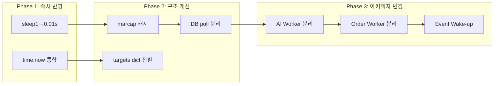

# KiwoomSniperV2 성능 검토 보고서

> **검토 대상:** [`src/engine/kiwoom_sniper_v2.py`](../src/engine/kiwoom_sniper_v2.py) — 메인 스나이퍼 엔진  
> **종속 모듈:** [`sniper_state_handlers.py`](../src/engine/sniper_state_handlers.py) (5374 lines), [`db_manager.py`](../src/database/db_manager.py) (738 lines), [`kiwoom_websocket.py`](../src/engine/kiwoom_websocket.py) (1030 lines)  
> **작성일:** 2026-04-25  
> **분석 범위:** 메인 루프 구조, 상태 핸들러 호출 체인, DB/API 동기 호출 패턴, 자료구조 사용, 스레드 관리

---

## 1. 아키텍처 개요

본 엔진은 **Event-Driven (Push) + Memory Snapshot & Polling (Pull)** 하이브리드 모델이다.

- **EventBus**를 통한 Pub/Sub: Telegram 발송, 스캐너 지시, DB 상태 변경 알림 → 비동기 이벤트
- **ws_data (Memory Dictionary)** 실시간 웹소켓 데이터 → `KiwoomWSManager`가 메모리에 최신 상태만 유지, 메인 루프가 Pull 방식으로 읽음

이 설계는 웹소켓 폭주로 인한 큐 병목을 회피한다는 점에서 적절하다.  
하지만 **메인 루프 내 동기 블로킹 I/O**와 **고정 sleep**이 구조적 한계로 작용한다.

---

## 2. 🚨 크리티컬 병목 (Critical Bottlenecks)

### 2.1 고정 Sleep 기반 폴링 주기 — [`time.sleep(1)`](src/engine/kiwoom_sniper_v2.py:1344)

```python
# line 1340-1344
targets[:] = [t for t in targets if t.get('status') not in ['COMPLETED', 'EXPIRED']]
if time.time() - getattr(run_sniper, "last_ws_prune_time", 0) >= 5:
    _prune_ws_subscriptions_for_inactive_targets(targets)
    run_sniper.last_ws_prune_time = time.time()
time.sleep(1)   # <-- 최대 1초 Latency
```

**문제:**  
웹소켓 데이터는 실시간으로 메모리(`ws_data`)에 업데이트되지만, 이를 평가하는 메인 루프가 매 틱마다 1초간 강제 대기한다. 타점 발생 후 최대 1초의 반응 지연이 발생하며, 0.1초 차이로 호가창이 급변하는 스캘핑에 치명적이다.

**검증:**  
- `run_sniper` 함수의 `while True` 루프 종단에 위치 (`line 1344`)
- 루프 1회 iteration에 실제 연산 시간을 제외한 순수 대기 시간이 1초
- 현재 감시 종목 수가 40개를 초과할 경우 iteration당 소요 시간은 1초 + α

**권장:**  
- `time.sleep(0.01~0.05)` (10ms~50ms) 수준으로 폴링 주기 단축  
- 또는 `Condition Variable`/`Event` 기반 Wake-up 패턴으로 전환 (ws_data 갱신 시에만 루프 기동)

### 2.2 동기 DB 호출에 의한 루프 블로킹

#### 2.2.1 [`_resolve_stock_marcap()`](src/engine/kiwoom_sniper_v2.py:192) → [`DB.get_latest_marcap()`](src/database/db_manager.py:556)

```python
def _resolve_stock_marcap(stock, code) -> int:
    existing = int(float(stock.get('marcap', 0) or 0))
    if existing > 0:
        return existing
    marcap = int(DB.get_latest_marcap(code) or 0)  # ← 동기 DB 조회
```

**문제:**  
- `check_watching_conditions()`의 SCALPING 경로(kiwoom_sniper_v2.py:522)와 KOSDAQ_ML/KOSPI_ML 경로(kiwoom_sniper_v2.py:578), 그리고 `handle_watching_state()` (sniper_state_handlers.py:1941)가 **매 루프마다** 호출됨
- DB 응답 50ms 기준, 종목 10개면 0.5초 블로킹
- `DB.get_latest_marcap()`은 SQL 쿼리로, PostgreSQL 커넥션 풀에서 세션 획득 후 실행 (db_manager.py:556-569)

**권장:**  
- DB 조회는 별도 백그라운드 스레드/비동기 Task로 오프로딩
- 메인 루프는 항상 메모리 캐시(Dictionary)만 참조
- 캐시 미스 시 `return 0` 처리 후 EventBus로 백그라운드 조회 요청

#### 2.2.2 [`DB.get_active_targets()`](src/database/db_manager.py:445) 5초 주기 Polling

```python
# line 1201-1212 (kiwoom_sniper_v2.py)
if time.time() - last_db_poll_time > 5:
    db_targets = DB.get_active_targets() or []  # ← pd.read_sql() 동기 호출
```

**문제:**  
- `get_active_targets()`는 내부에서 `pd.read_sql()`을 사용 (db_manager.py:479)
- Pandas DataFrame 생성 → dict 변환 → 기본값 보정까지 전체 파이프라인이 동기 실행
- PostgreSQL 세션 획득, 서브쿼리 실행(marcap 조인) 포함으로 복잡도 높음
- 5초 주기지만 호출 시점에 루프 전체 블로킹

**권장:**  
- `get_active_targets()`는 독립 스레드에서 실행하고 결과만 원자적(atomic)으로 교체
- 새 타겟 감지는 메모리 기반으로 처리, DB 동기는 최소화

### 2.3 상태 핸들러 내 무거운 동기 작업

#### 2.3.1 AI API 동기 호출

[`handle_watching_state()`](src/engine/sniper_state_handlers.py:2239):
```python
ai_decision = ai_engine.analyze_target(
    stock['name'], ws_data, recent_ticks, recent_candles,
    prompt_profile="watching",
)
```

[`handle_holding_state()`](src/engine/sniper_state_handlers.py:3562) 및 (sniper_state_handlers.py:3804):
```python
ai_decision = ai_engine.analyze_target(
    stock['name'], ws_data, recent_ticks, recent_candles,
    cache_profile="holding", prompt_profile="holding",
)
```

**문제:**  
- Gemini/OpenAI/DeepSeek API 호출은 네트워크 I/O로 수 초까지 지연 가능
- 메인 스레드가 AI 응답을 기다리는 동안 모든 종목의 평가가 중단됨
- AI 호출 전 `get_tick_history_ka10003()`, `get_minute_candles_ka10080()` 도 동기 Kiwoom API 호출 (sniper_state_handlers.py:2235-2236)

**권장:**  
- AI 추론은 별도 워커 스레드/프로세스 풀로 오프로딩
- 메인 루프는 `AI_ANALYZING` 상태로 변경 후 즉시 다음 종목 평가
- 결과는 콜백/EventBus로 수신

#### 2.3.2 Kiwoom API 동기 호출 (매수/매도 주문)

```python
# sniper_state_handlers.py:1588
res = kiwoom_orders.send_cancel_order(code=code, orig_ord_no=ord_no, token=KIWOOM_TOKEN, qty=0)
# sniper_state_handlers.py:1745
res = kiwoom_orders.send_sell_order_market(code=code, qty=buy_qty, token=KIWOOM_TOKEN)
```

**문제:**  
- **Kiwoom REST API는 HTTP 기반 동기 호출**이며, 증권사 API 지연(50~500ms)이 발생
- 매수/매도 주문이 메인 루프에서 직접 실행되므로, 주문 처리 중 다른 종목 평가 불가
- `_dispatch_scalp_preset_exit()` (sniper_state_handlers.py:3407) → `_send_exit_best_ioc()` 호출 체인에서도 동일

**권장:**  
- 주문 전용 Background Worker 스레드 도입
- 메인 루프는 `ORDER_REQUESTED` 상태 설정 후 즉시 복귀
- Worker가 주문 실행, 결과를 EventBus로 발행

---

## 3. ⚠️ 중간 위험도 최적화 포인트 (Moderate Issues)

### 3.1 리스트 재생성 — [`targets[:] = [...]`](src/engine/kiwoom_sniper_v2.py:1340)

```python
targets[:] = [t for t in targets if t.get('status') not in ['COMPLETED', 'EXPIRED']]
```

**문제:**  
- 매 iteration마다 전체 감시 리스트를 새로 생성 → GC 부담 증가
- 폴링 주기를 10ms로 단축 시 초당 100회의 리스트 재할당 발생
- 종목 40개 기준으로도 불필요한 메모리 할당/해제 반복

**권장:**  
- `dict` (key=종목코드) 기반 상태 관리로 전환
- 삭제 조건 항목만 `dict.pop()` 처리
- 또는 약한 참조(WeakRef) 자료구조 검토

### 3.2 [`datetime.now()`](src/engine/kiwoom_sniper_v2.py:1184) 및 [`time.time()`](src/engine/kiwoom_sniper_v2.py:1184) 중복 호출

**메인 루프:**  
- `line 1184`: `now = datetime.now()` — 루프당 1회  
- `line 1185`: `now_t = now.time()` — 재사용  

**하지만 핸들러에서 재호출:**  
- `check_watching_conditions()` (kiwoom_sniper_v2.py:482): `now = datetime.now()`  
- `evaluate_scalping_exit()` (kiwoom_sniper_v2.py:774, 790, 840): `datetime.now()` 3회  
- `handle_watching_state()` (sniper_state_handlers.py:1875): `now = datetime.now()`  
- `handle_holding_state()` (sniper_state_handlers.py:3647): `now = datetime.now()`  
- `_resolve_holding_elapsed_sec()` (sniper_state_handlers.py:1211, 1231): `time.time()` 및 `datetime.now()`  
- `_get_ws_snapshot_age_sec()` (sniper_state_handlers.py:921): `time.time()`

**영향:**  
- 시스템 콜(syscall) 유발 함수가 루프 1 tick 내에서 수십 회 호출
- 폴링 주기 단축 시(syscall overhead가 상대적으로 증가) 영향 커짐

**권장:**  
- 메인 루프 최상단에서 `current_time = time.time()`, `current_dt = datetime.now()` 1회 선언
- 모든 핸들러/평가 함수에 인자로 전달하여 재사용

### 3.3 무한 스레드 생성 — [`threading.Thread(target=periodic_account_sync, daemon=True).start()`](src/engine/kiwoom_sniper_v2.py:1268)

```python
if time.time() - getattr(run_sniper, 'last_account_sync_time', 0) > 90:
    threading.Thread(target=periodic_account_sync, daemon=True).start()
    run_sniper.last_account_sync_time = time.time()
```

**문제:**  
- 90초마다 새 스레드 생성/파기 반복
- Python 스레드 생성 비용(약 8KB 메모리 + 커널 오버헤드)이 누적
- 장기 운용(예: 6시간 = 240회 생성) 시 리소스 단편화 가능

**권장:**  
- `ThreadPoolExecutor`로 워커 재사용
- 또는 시작 시 1개의 전용 백그라운드 스레드 + Queue/Timer 패턴

### 3.4 [`handle_watching_state()`](src/engine/sniper_state_handlers.py:1815) 함수 길이

**5374 라인 중 약 700라인**(1815~2500+) 차지:

- Big-Bite arm/confirm (lines 2006-2063)
- Strength momentum 평가 (lines 2089-2120)
- VPW/유동성/갭 검사 (lines 2122-2214)
- AI 분석 + Shadow Prompt + Recovery Canary (lines 2232-2458)
- Gatekeeper 리포트 (lines 2499+)
- Target buy price 결정 및 매수 실행 (lines 2700+)

**문제:**  
- 하나의 함수가 너무 많은 책임을 가짐 (SRP 위반)
- 가독성 저하 및 유지보수 어려움
- 불필요한 조건 분기가 매 루프마다 평가되어 CPU 오버헤드

**권장:**  
- 조건별 가드(Gate) 함수 분리 (e.g., `_check_vpw_gate()`, `_check_liquidity_gate()`, `_check_ai_gate()`)
- 조기 리턴(Early Return) 패턴 강화

---

## 4. 📊 성능 영향 매트릭스

| # | 항목 | 위치 | 영향도 | 지연 시간(추정) | 타겟 레이턴시 |
|---|------|------|--------|---------------|-------------|
| 1 | `time.sleep(1)` | kiwoom_sniper_v2.py:1344 | 🔴 **Critical** | 1000ms | ≤50ms |
| 2 | AI API 동기 호출 `analyze_target()` | sniper_state_handlers.py:2239, 3562, 3804 | 🔴 **Critical** | 500~3000ms | ≤100ms (별도 스레드) |
| 3 | Kiwoom API 주문 동기 호출 | sniper_state_handlers.py:1588, 1745 | 🔴 **Critical** | 50~500ms | ≤10ms (Async) |
| 4 | `DB.get_active_targets()` 동기 SQL | kiwoom_sniper_v2.py:1202 | 🟡 **High** | 20~200ms | 분리 실행 |
| 5 | `_resolve_stock_marcap()` DB 조회 | kiwoom_sniper_v2.py:200, sniper_state_handlers.py:1941 | 🟡 **High** | 10~50ms | 메모리 캐시 |
| 6 | 리스트 재생성 `targets[:] = [...]` | kiwoom_sniper_v2.py:1340 | 🟢 **Medium** | ~0.1ms | dict 기반 |
| 7 | `datetime.now()` / `time.time()` 중복 | 전체 산재 | 🟢 **Medium** | ~0.001ms xN | 1회 통합 |
| 8 | 스레드 무한 생성 | kiwoom_sniper_v2.py:1268 | 🟢 **Low** | 누적 리소스 | ThreadPool |

---

## 5. 🎯 실행 우선순위 (Action Items)

### Phase 1: 즉시 반영 (Low Risk, High Impact)

| # | Action | 파일 | 예상 난이도 |
|---|--------|------|-----------|
| P1-1 | `time.sleep(1)` → `time.sleep(0.01~0.05)` | kiwoom_sniper_v2.py:1344 | ⭐ (단순 변경) |
| P1-2 | 메인 루프에 `now_ts` 통합 변수 선언 및 핸들러 전달 | kiwoom_sniper_v2.py:1184, sniper_state_handlers.py 전반 | ⭐ (리팩토링) |

### Phase 2: 구조 개선 (Medium Risk, High Impact)

| # | Action | 상세 | 예상 난이도 |
|---|--------|------|-----------|
| P2-1 | `_resolve_stock_marcap()` DB 조회 → 메모리 캐시 전환 | DB 조회를 EventBus 백그라운드 요청으로 변경 | ⭐⭐ |
| P2-2 | `targets` → `dict[code]` 기반 상태 관리로 전환 | 리스트 재생성 제거, `dict.pop()` 사용 | ⭐⭐ |
| P2-3 | `DB.get_active_targets()` 백그라운드 스레드 분리 | 독립 갱신, atomic 스왑 | ⭐⭐⭐ |
| P2-4 | `periodic_account_sync` ThreadPoolExecutor 적용 | 스레드 재사용 | ⭐ |

### Phase 3: 주요 아키텍처 변경 (High Risk, High Impact)

| # | Action | 상세 | 예상 난이도 |
|---|--------|------|-----------|
| P3-1 | AI 추론 워커 스레드 분리 | `AI_ANALYZING` 상태 도입, 콜백 처리 | ⭐⭐⭐⭐ |
| P3-2 | Kiwoom 주문 전용 Worker 분리 | 주문 큐(Queue) + 전용 스레드 | ⭐⭐⭐⭐ |
| P3-3 | Event/Condition Variable 기반 Wake-up 패턴 | ws_data 갱신 시 루프 기동, Busy-wait 제거 | ⭐⭐⭐⭐⭐ |

---

## 6. 📋 발췌: 주요 코드 라인 맵

| 설명 | 파일 | 라인 |
|------|------|------|
| 메인 루프 진입 | [`kiwoom_sniper_v2.py`](../src/engine/kiwoom_sniper_v2.py) | 1177 |
| 1초 sleep | [`kiwoom_sniper_v2.py`](../src/engine/kiwoom_sniper_v2.py) | 1344 |
| 2초 부팅 sleep | [`kiwoom_sniper_v2.py`](../src/engine/kiwoom_sniper_v2.py) | 1029 |
| DB 활성 타겟 Polling | [`kiwoom_sniper_v2.py`](../src/engine/kiwoom_sniper_v2.py) | 1201-1212 |
| 시가총액 DB 조회 (메인) | [`kiwoom_sniper_v2.py`](../src/engine/kiwoom_sniper_v2.py) | 200 |
| 시가총액 DB 조회 (핸들러) | [`sniper_state_handlers.py`](../src/engine/sniper_state_handlers.py) | 888 |
| AI WATCHING 분석 | [`sniper_state_handlers.py`](../src/engine/sniper_state_handlers.py) | 2239 |
| AI HOLDING 분석 (TP) | [`sniper_state_handlers.py`](../src/engine/sniper_state_handlers.py) | 3562 |
| AI HOLDING 분석 (일반) | [`sniper_state_handlers.py`](../src/engine/sniper_state_handlers.py) | 3804 |
| 주문 취소 (동기) | [`sniper_state_handlers.py`](../src/engine/sniper_state_handlers.py) | 1588 |
| 시장가 매도 (동기) | [`sniper_state_handlers.py`](../src/engine/sniper_state_handlers.py) | 1745 |
| 계좌 동기화 스레드 생성 | [`kiwoom_sniper_v2.py`](../src/engine/kiwoom_sniper_v2.py) | 1268 |
| 리스트 재생성 | [`kiwoom_sniper_v2.py`](../src/engine/kiwoom_sniper_v2.py) | 1340 |
| `datetime.now()` 중복 (핸들러) | [`sniper_state_handlers.py`](../src/engine/sniper_state_handlers.py) | 1875, 3647 |
| DB get_active_targets() SQL | [`db_manager.py`](../src/database/db_manager.py) | 445-548 |
| DB get_latest_marcap() SQL | [`db_manager.py`](../src/database/db_manager.py) | 556-573 |
| WS 폴링 sleep 50ms | [`kiwoom_websocket.py`](../src/engine/kiwoom_websocket.py) | 277 |

---

## 7. 💡 권장 리팩토링 로드맵



**핵심 목표:** 메인 `while True` 루프를 **"절대 멈추지 않는 초고속 평가기(Evaluator)"** 로 전환한다.

- Phase 1: 폴링 주기 단축 및 인라인 중복 제거 (1~2일)
- Phase 2: DB 의존성 제거 및 자료구조 최적화 (3~5일)
- Phase 3: AI/주문 비동기화 및 Wake-up 패턴 도입 (1~2주)

> **참고:** 본 보고서는 정적 코드 분석 기반이며, 실제 운영 환경에서의 프로파일링(CPU, I/O Wait, GIL 경합)을 병행하여 우선순위를 검증할 것을 권장합니다.
